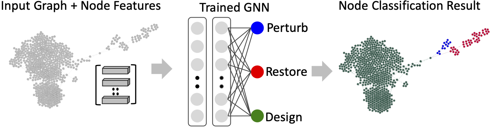

# GNNUnlock: Graph Neural Networks-based Oracle-less Unlocking Scheme for Provably Secure Logic Locking
Lilas Alrahis, Satwik Patnaik, Faiq Khalid, Muhammad Abdullah Hanif, Hani Saleh, Muhammad Shafique, and Ozgur Sinanoglu

**Contact**
Lilas Alrahis (lma387@nyu.edu)
### Overview 
GNNUnlock is the first-of-its-kind oracle-less machine learning-based attack on provably secure logic locking (PSLL) that can identify any desired protection logic without focusing on a specific syntactic topology. The key is to leverage a well-trained graph neural network (GNN) to identify all the gates in a given locked netlist that belong to the targeted protection logic, without requiring an oracle. 



### About This Repo
This repo contains the source code of the netlist-to-graph transformation from our paper (DATE '21, see the [Citation](#Citation-&-Acknowledgement) Section). The scripts released here parse Anti-SAT/SFLL-HD locked circuits in bench/Gate-level Netlist format. Please contact Lilas Alrahis (lma387@nyu.edu) if you wish to expand Verilog netlists parsing to handle different tech libs. Also, please contact us if you wish to adapt the code to handle different locking schemes.
### Dependencies
* python >= 3.6.8
* tensorflow >=1.12.0  / pytorch >= 1.1.0
* cython >=0.29.2
* numpy >= 1.14.3
* scipy >= 1.1.0
* scikit-learn >= 0.19.1
* pyyaml >= 3.12
* g++ >= 5.4.0
* openmp >= 4.0

* [GraphSAINT](https://github.com/GraphSAINT/GraphSAINT) - Graph sampling-based training for node classification.
* More info regarding conda env setup/creation is given below.
## Netlist-to-graph Conversion
### Datasets
The `./Netlist_to_graph/Circuits_datasets/` directory contains the `ANTI_SAT_DATASET_c7552` dataset used in (DATE '21). The dataset contains 30 locked ISCAS benchmark circuits.
- 16 circuits are used for training
     - 8 locked versions of c2670 and 8 locked versions of c5315
- 6 circuits are used for validation
    - 6 locked versions of c3540
- 8 circuits are kept for testing
    - 8 locked versions of c7552
    
When creating a dataset, the files used for training, validation or testing must be identified. To split files into Test/Train/validate, the files must be named accordingly. A locked file must be named as follows: [Test|Train|Validate]_*.bench

The directory also contains two datasets for SFLL-HD. For the case of SFLL-HD, the locking is performed at RTL. Then, the locked files are synthesized using Synopsys design compiler with Global Foundries 65nm LPe.
### Conversion to Graphs
**Scripts**  

The following scripts are required for the conversion:  
`TheCircuit.pm`: a Perl module we create to ease circuit's parsing. This module is required by our parsers `./Netlist_to_graph/Parsers/AntiSAT_bench_to_graph.pl` and `./Netlist_to_graph/Parsers/SFLL_Verilog_to_graph.pl`

`./Netlist_to_graph/Parsers/AntiSAT_bench_to_graph.pl`: a Perl script that reads all of the locked files (in Bench format) in a given dataset and converts the dataset into a single graph. It assigns unique numerical IDs (0 to N-1) to the nodes (gates). N represents the total number of nodes (gates) in the dataset. The list of nodes in the training set will be dumped in `tr.txt`. The list of nodes in the testing set will be dumped in `te.txt`. The list of nodes in the validation set will be dumped in `va.txt`. The extracted features will be dumped in `feat.txt`. The existence of an edge i between two vertices u and v is represented by the entry of ith line in `row.txt` (representing u's ID) and the entry of the ith line in `col.txt` (representing v's ID). The `row_tr.txt` and `col_tr.txt` are created to identify the edges exclusive to the training set.  

`./Netlist_to_graph/Parsers/SFLL_Verilog_to_graph.pl`: a Perl script that reads all of the locked files (Synthesized Gate-level Netlists) in a given dataset and converts the dataset into a single graph. It assigns unique numerical IDs (0 to N-1) to the nodes (gates). N represents the total number of nodes (gates) in the dataset. The list of nodes in the training set will be dumped in `tr.txt`. The list of nodes in the testing set will be dumped in `te.txt`. The list of nodes in the validation set will be dumped in `va.txt`. The extracted features will be dumped in `feat.txt`. The existence of an edge i between two vertices u and v is represented by the entry of ith line in `row.txt` (representing u's ID) and the entry of the ith line in `col.txt` (representing v's ID). The `row_tr.txt` and `col_tr.txt` are created to identify the edges exclusive to the training set.  

`./Netlist_to_graph/Parsers/graph_parser.py`: a Python script that processes the files created by the Perl parser and generates the files required by GraphSAINT. It will mainly create the following files:  
`Dataset_info_log.txt`: log file with detailed information about the dataset.  
`adj_full.npz`: a sparse matrix in CSR format, stored as a `scipy.sparse.csr_matrix`. The shape is N by N.  
`adj_train.npz`: a sparse matrix in CSR format, stored as a `scipy.sparse.csr_matrix`. The shape is also N by N. However, non-zeros in the matrix only correspond to edges connecting two training nodes.  
`role.json`: a dictionary of three keys. Key `'tr'` corresponds to the list of all training node indices. Key `va` corresponds to the list of all validation node indices. Key `te` corresponds to the list of all test node indices.  
`class_map.json`: a dictionary of length N. Each key is a node index, and each value is a length C binary list. C represents the number of classes. For the case of Anti-SAT it is 2. For the case of SFLL-HD it is 3 (label 0 for restore, label 1 for perturb, and label 2 for design nodes). 
`feats.npy`: a `numpy` array of shape N by F. F is the length of the feature vector. For the case of circuits in Bench format, F=13.  
**Running the Conversion**   
1) Create and activate conda environment with the required dependencies.
    ```sh
    $ conda create --name myenv python=3.6.8 tensorflow=1.12.0
    $ conda activate myenv
    $ conda install -c anaconda numpy=1.14.3
    $ conda install -c anaconda scipy=1.1.0 
    $ conda install -c anaconda scikit-learn=0.19.1
    $ conda install -c anaconda pyyaml=3.12
    $ conda install -c conda-forge openmp=4.0
    $ conda install -c anaconda cython=0.29.2
    ```
2) Modify line 6 in `AntiSAT_bench_to_graph.pl` and place the full path to `theCircuit.pm`. Modify line 8 in `SFLL_Verilog_to_graph.pl` and place the full path to `theCircuit.pm`.
3) Perform the conversion:  
    ```sh
    $ mkdir -p ./Netlist_to_graph/Graphs_datasets/anti_sat_iscas_c7552/
    $ cd ./Netlist_to_graph/Graphs_datasets/anti_sat_iscas_c7552/
    $ cp ../../Parsers/graph_parser.py .
    $ perl ../../Parsers/AntiSAT_bench_to_graph.pl -i ../../Circuits_datasets/ANTI_SAT_DATASET_c7552 > log.txt
    $ python graph_parser.py
    $ cd ../../../
    ```
    For the case of SFLL-HD, replace `AntiSAT_bench_to_graph.pl` with `SFLL_Verilog_to_graph.pl`. Unzip the SFLL circuit datasets before parsing.
## Node Classification

GNNUnlock requires [GraphSAINT](https://github.com/GraphSAINT/GraphSAINT) to perform node classification (ICLR'20). We have used the TensorFlow implementation of GraphSAINT in all of the experiments reported in (DATE'21 and TETC'21).
Install GraphSAINT
```sh
$ git clone https://github.com/GraphSAINT/GraphSAINT.git
$ cd GraphSAINT
```
Compilation (done only once)
```sh
$ python graphsaint/setup.py build_ext --inplace
```
Launch Node Classification:
```sh
$ python -m graphsaint.tensorflow_version.train --data_prefix ../Netlist_to_graph/Graphs_datasets/anti_sat_iscas_c7552 --train_config ../DATE21.yml --gpu -1 > log_training.txt
```
`DATE21.yml` contains the hyperparameters used in (DATE '21) for Anti-SAT
`SFLL_params.yml` contains the hyperparameters used in (DATE '21) for SFLL-HD h=2
## Citation & Acknowledgement
If you find the code useful, please cite our papers:
* DATE 2021:
```
@inproceedings{alrahis2020gnnunlock,
title={{GNNU}nlock: Graph Neural Networks-based Oracle-less Unlocking Scheme for Provably Secure Logic Locking},
author={Alrahis, Lilas and Patnaik, Satwik and Khalid, Faiq and Hanif, Muhammad Abdullah and Saleh, Hani and Shafique, Muhammad and Sinanoglu, Ozgur},
booktitle={IEEE/ACM Design, Automation and Test in Europe Conference}, 
pages={780--785},
year={2021}
}
```
* TETC 2021:
```
@ARTICLE{GNNUnlock_TETC,
  author={Alrahis, Lilas and Patnaik, Satwik and Hanif, Muhammad Abdullah and Saleh, Hani and Shafique, Muhammad and Sinanoglu, Ozgur},
  journal={IEEE Transactions on Emerging Topics in Computing}, 
  title={{GNNU}nlock+: A Systematic Methodology for Designing Graph Neural Networks-based Oracle-less Unlocking Schemes for Provably Secure Logic Locking}, 
  year={2021},
  volume={},
  number={},
  pages={1-1},
  doi={10.1109/TETC.2021.3108487}}
```
We owe many thanks to [Hanqing Zeng](https://sites.google.com/a/usc.edu/zengh/home) for making his GraphSAINT code available.


